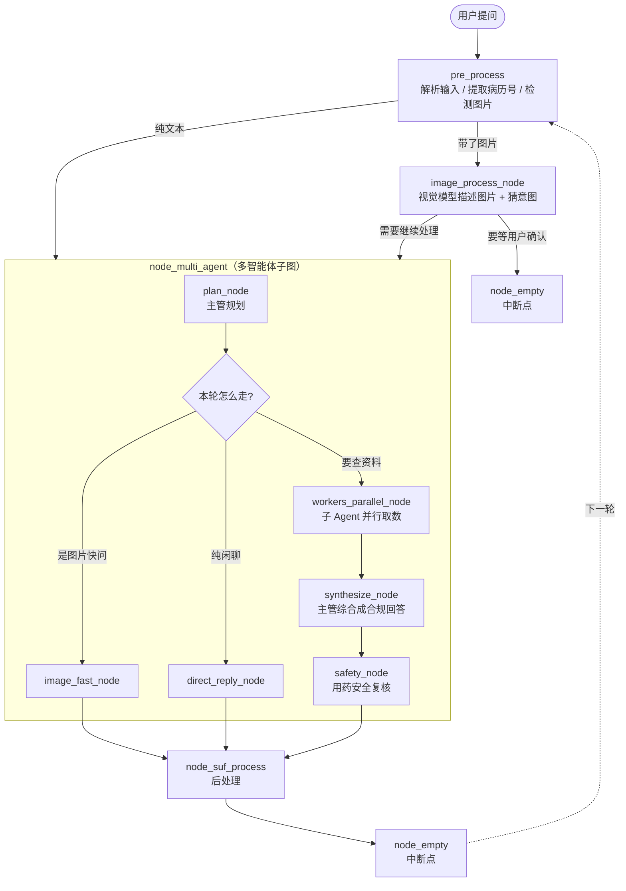

# 🩺 VVM 数智医生智能体

> 一个面向**皮肤科**的 AI 问诊助手：能翻患者病历、查医学知识库、联网搜最新资料、看皮肤患处照片，
> 并且在把答案交给你之前，先过一道**用药安全复核**。

基于 **LangGraph** 的「主管—子 Agent」多智能体架构，后端 FastAPI、前端 Vue 3，配套命令行工具和 Web 界面。

> ⚠️ **本项目仅供技术研究与内部演示，不能替代执业医师的诊断。** 且涉及患者隐私数据（PHI），
> 请务必阅读文末的 [安全与隐私](#-安全与隐私-) 章节后再决定如何部署。

---

## 📖 目录

- [它解决什么问题](#-它解决什么问题)
- [核心特性](#-核心特性)
- [整体架构](#-整体架构)
- [目录结构](#-目录结构)
- [技术栈](#-技术栈)
- [快速开始](#-快速开始)
- [使用方式](#-使用方式)
- [技能系统](#-技能系统)
- [配置项说明](#-配置项说明)
- [安全与隐私](#-安全与隐私-)
- [常见问题](#-常见问题)
- [已知限制](#-已知限制)

---

## 🎯 它解决什么问题

一个皮肤科医生在门诊里，回答一个患者问题通常要同时做四件事：

1. **翻病历** —— 这个患者以前得过什么？用过什么药？有没有过敏？
2. **查专业知识** —— 这个症状/药物在权威资料里怎么说？
3. **找最新信息** —— 最近有没有新疗法、新指南？
4. **看照片** —— 患者发来的患处照片到底是什么皮损？

这四件事分散在不同系统里（HIS 系统、医学数据库、搜索引擎、看图工具），医生得来回切换。

本项目把这四件事包装成**四个可以并行干活的子 Agent**，由一个「主管」统一调度：

> 用户问一句话 → 主管判断需要哪几个子 Agent → 它们同时去取数据 → 主管把结果融合成一段人话 →
> 安全专员复核一遍 → 输出给用户

---

## ✨ 核心特性

| 特性 | 说明 |
|---|---|
| 🤖 **多智能体编排** | 主管（Supervisor）动态规划本轮该调用哪些子 Agent，而不是写死流程 |
| ⚡ **并行取数** | 多个子 Agent 用 `asyncio.gather` 同时执行，总耗时 ≈ 最慢的那个，而不是全部相加 |
| 🚨 **急症硬规则前置** | 命中「呼吸困难」「大出血」等关键词时，**跳过整条链路**直接给急诊指引（不用等 40 秒） |
| 🛡️ **用药安全复核** | 独立的安全 Agent 检查回答里有没有越界（开处方、下诊断、剂量错误） |
| 🖼️ **皮肤病图像识别** | 集成 YOLOv10 / YOLOv11 模型，识别皮肤患处 |
| 🔌 **技能热插拔** | 每个子 Agent 能用哪些技能存在数据库里，前端点一下即生效，**不用重启服务** |
| 💬 **流式输出** | SSE 逐字返回，带「思考过程」折叠展示 |
| 🧠 **多轮记忆** | 会话状态存在 MySQL（LangGraph Checkpoint），服务重启后对话不丢 |
| 📦 **可扩展技能包** | 支持从 ClawHub 安装第三方技能包（如天气查询、健身计划） |

---

## 🏗 整体架构

### 一张图看懂



> **为什么最后要绕回 `pre_process`？** 这是一张「多轮回路」图——每轮结束停在 `node_empty`，
> 由 LangGraph 的 `interrupt_after` 把控制权交还给用户，用户再说下一句时继续跑。
> 这样整套对话状态（含中间结果）都由 Checkpoint 自动保存，天然支持断点续跑。

### 子 Agent 分工

| 子 Agent | 职责 | 典型技能 | 是否并行 |
|---|---|---|---|
| `patient_knowledge_agent` | 查患者本人的病历 + 查公共医学知识库 | `mysql_query`、`milvus_query` | ✅ |
| `search_agent` | 联网搜最新信息（新药、新指南、时事） | `web_search` | ✅ |
| `imaging_agent` | 皮肤患处照片识别 | `derma_image` | ✅ |
| `general_agent` | 通用助手：闲聊、常识、天气等非医疗问题 | 视配置而定 | ✅ |
| `safety_agent` | **不取数**，只复核最终回答的合规性 | — | 串行（最后一道） |

这些 Agent 的开关写在 `application.yaml` 的 `multi_agent.agents` 里，**默认全开**，
显式写 `false` 才会关闭。

### 一次完整对话发生了什么

以「最近这个病有没有新疗法？」为例：

```
1. pre_process        解析输入，看看有没有带病历号 / 图片         ~0.1s
2. plan_node          主管调 qwen-max 决策：需要 search + knowledge  ~2s
3. workers_parallel   两个子 Agent 同时跑（Milvus 检索 + Tavily 搜索）~3s  ← 并行，不是 6s
4. synthesize_node    主管把两路结果合成一段回答（复用合规 prompt）  ~5s
5. safety_node        安全专员复核：有没有开处方 / 下诊断？          ~2s
6. post_process       格式化，推给前端
```

> 📌 仓库里 `agent/utils/emergency.py` 的注释记录了改造前的实测数据：急症问题走完整链路要 **47.9 秒、9 次 LLM 调用**。
> 这就是为什么急症规则必须前置短路。

---

## 📁 目录结构

```
vvm/
├── main.py                      # 最简命令行入口（读 input()，适合快速调试）
├── cli.py                       # 增强版 CLI：历史记录 + 彩色输出 + /crm /doctor 等命令
├── run_dev.ps1                  # 一键启动开发环境（后端 8001 + 前端 5173）
├── start.ps1                    # 旧版启动脚本（路径已过期，建议用 run_dev.ps1）
├── pyproject.toml / uv.lock     # Python 依赖声明（uv 管理）
│
├── agent/                       # 🧠 智能体核心
│   ├── digital_smart_doctor_agent.py   # 主入口：建图 + 管理 MySQL 连接 + 对外 aprocess()
│   ├── core/
│   │   ├── graph_builder.py     # 主图装配（pre_process → 多Agent → post_process 回路）
│   │   ├── state.py             # 图的状态定义（在节点间流转的数据结构）
│   │   └── constants.py         # 中断节点、日志配置
│   ├── multi_agent/             # 多智能体编排
│   │   ├── graph.py             # 子图装配（plan → workers → synthesize → safety）
│   │   ├── orchestrator.py      # 各节点的真实实现
│   │   ├── supervisor.py        # 主管：规划 + 综合
│   │   ├── workers.py           # L1 数据型子 Agent（病历/知识/搜索/图像/通用）
│   │   ├── reasoning_workers.py # L2 推理型子 Agent（安全）
│   │   ├── agent_registry.py    # 子 Agent 注册表 + 动态生成描述给主管看
│   │   ├── skill_executor.py    # 技能执行薄壳
│   │   ├── worker_skill_provider.py  # 从数据库读「某子 Agent 启用了哪些技能」
│   │   ├── prompts.py           # 主管规划 / 安全复核的提示词
│   │   └── schemas.py           # AgentTask / AgentResult / SupervisorPlan
│   ├── nodes/                   # 主图节点
│   │   ├── pre_process_node.py
│   │   ├── image_process_node.py
│   │   ├── post_process_node.py
│   │   └── routing_node.py
│   ├── tools/                   # 技能调用工具
│   └── utils/                   # 工具集（LLM 封装 / 急症规则 / 病历号提取 / 命令执行…）
│
├── backend/                     # 🌐 FastAPI 服务
│   ├── chat_server.py           # 【主服务】端口 8001：对话 API + 文件上传 + 患者检索 + 管理接口
│   ├── main.py                  # 【旧服务】端口 8000：独立的管理 API（已被 8001 合并，保留兼容）
│   ├── routes/                  # skills / worker_skills 两套管理路由
│   ├── services/                # 业务逻辑层（技能管理、Agent 管理、关联关系）
│   ├── models/                  # SQLAlchemy ORM（agent / skill / agent_skill）
│   ├── database/                # 数据库会话工厂
│   └── utils/                   # 文件管理、集成工具
│
├── frontend/                    # 💻 Vue 3 + Vite 前端
│   └── src/
│       ├── App.vue              # 主界面：对话流式渲染 + 会话参数 + 思考过程折叠
│       └── components/
│           ├── SkillManager.vue        # 技能池管理（上传 / 列表 / 删除）
│           └── WorkerSkillManager.vue  # 给每个子 Agent 勾选启用哪些技能
│
├── skills/                      # 🔧 内置技能实现
│   ├── mysql_query_skill.py     # 查患者结构化档案
│   ├── milvus_query_skill.py    # 查公共医学知识库
│   ├── web_search_skill.py      # 联网搜索
│   ├── derma_image_skill.py     # 皮肤病图片检测
│   ├── registry.py / schemas.py # 技能注册与数据契约
│   └── skills_optimize_srh/     # 动态技能注册中心（SQLite 索引 + 权限 + 沙箱执行）
│
├── vector/                      # 🔍 向量库
│   ├── milvus_vector.py         # Milvus 封装（DashScope Embedding）
│   └── init/                    # 建库脚本：疾病 / 药品 / 知识 / QA 四个集合
│
├── data/                        # 📊 数据（⚠️ 大部分已被 .gitignore 屏蔽）
│   ├── datasets/                # 数据集处理脚本（对话解析、药品表解析、腾讯 ASR）
│   ├── dialog2qa.py             # 把医患对话转成 QA 对
│   ├── milvus_to_excel.py       # 从 Milvus 导出到 Excel
│   ├── 药品库_sample.xlsx        # 药品库表结构样例（真实全量库已屏蔽）
│   └── eval.example.jsonl       # 评测集格式模板（真实评测集已屏蔽）
│
├── prompt/                      # 📝 提示词模板（对话 / 图像 / 技能 / 查询结果）
├── scripts/                     # 🧪 探针与运维脚本（端到端验证、技能播种等）
├── config/app_config.py         # ⚙️ 配置加载：yaml + 环境变量占位符展开
├── .env.example                 # 🔑 密钥模板（复制成 .env 填真实值）
├── application.example.yaml     # ⚙️ 配置模板（复制成 application.yaml）
│
├── logs/  uploads/  user_skills/  derma_image/   # 运行时产物（已屏蔽）
└── .gitignore                   # 🚫 屏蔽密钥与患者隐私数据
```

---

## 🧰 技术栈

| 层 | 选型 | 说明 |
|---|---|---|
| 编排 | **LangGraph 0.4** | 状态图 + Checkpoint，天然支持多轮中断与续跑 |
| LLM 框架 | **LangChain 0.3** | 消息抽象、结构化输出 |
| 大模型 | **阿里云百炼（DashScope）** | 主管用 `qwen-max` 保结构化决策，其余用 `qwen-plus` |
| 向量库 | **Milvus 2.5** | 存疾病 / 药品 / 知识 / QA 四类向量 |
| 关系库 | **MySQL + aiomysql / PyMySQL** | 业务配置 + 患者 CRM + LangGraph 会话状态 |
| 后端 | **FastAPI + Uvicorn** | 对话服务与管理 API |
| 前端 | **Vue 3 + Vite 8** | 对话界面 + 技能管理面板 |
| 图像识别 | **Ultralytics YOLOv10 / v11** | 皮肤病检测 |
| 语音识别 | **腾讯云 ASR** | 问诊录音转写 |
| 联网搜索 | **Tavily** | 为 LLM 优化的搜索 API |
| CLI | **prompt_toolkit + rich** | 历史记录 + 彩色流式输出 |
| 依赖管理 | **uv** | 比 pip 快得多的现代包管理器 |

---

## 🚀 快速开始

### 0. 环境要求

| 组件 | 版本 | 备注 |
|---|---|---|
| Python | **3.12.x** | `pyproject.toml` 里写死了 `==3.12.*` |
| Node.js | ≥ 18 | 跑前端 |
| MySQL | ≥ 5.7 | 可以用本机或云数据库 |
| Milvus | ≥ 2.4 | 本机可用 Docker 快速起一个 |
| uv | 最新 | `pip install uv` 或见 [uv 官网](https://docs.astral.sh/uv/) |

### 1. 克隆并安装依赖

```bash
git clone <你的仓库地址>
cd vvm

# 用 uv 创建虚拟环境并装依赖（会自动读 pyproject.toml + uv.lock）
uv sync

# 前端依赖
cd frontend && npm install && cd ..
```

### 2. 准备三个 MySQL 数据库

程序需要连接**三块**数据库（可同实例不同库）：

| 数据库 | 用途 | 配置位置 |
|---|---|---|
| 业务库 | 存 Agent 配置、技能池、Agent-技能关联 | `db.mysql` |
| 患者库 | 存病历等 PHI，敏感度最高 | `db.patient_mysql` |
| 会话库 | LangGraph 的对话 Checkpoint（自动建表） | 复用业务库 |

业务库的建表由后端启动时自动完成（见 `backend/database/session_factory.py`）。

### 3. 建 Milvus 向量集合（可选）

如果要启用知识库检索，需要先把资料灌进 Milvus：

```bash
python -m vector.init.disease_vector      # 疾病向量
python -m vector.init.medicine_vector     # 药品向量
python -m vector.init.knowledge_vector    # 知识文档向量（读 docx/pdf）
python -m vector.init.qa_vector           # 医患 QA 向量
```

> 跳过这一步项目也能跑，只是 `milvus_query` 技能会返回空结果。

### 4. 配置密钥

复制模板，填入你自己的真实值：

```powershell
# PowerShell
Copy-Item .env.example .env
Copy-Item application.example.yaml application.yaml
```

```bash
# bash
cp .env.example .env
cp application.example.yaml application.yaml
```

然后编辑 `.env`。取值顺序为 **真实环境变量 > `.env` 文件 > `${VAR:-默认值}`**。

### 5. 启动

```powershell
# 一键启动（后端 8001 + 前端 5173）
./run_dev.ps1
```

或者手动分两个终端：

```powershell
# 终端 1 —— 后端
.venv\Scripts\python.exe -m uvicorn backend.chat_server:app --port 8001

# 终端 2 —— 前端
cd frontend
npm run dev
```

打开 <http://localhost:5173> 即可开始对话。

> 📌 开发模式下前端通过 Vite proxy 把 `/api` 转发到 `http://localhost:8001`，所以浏览器端不需要配 CORS。

---

## 💻 使用方式

### 方式一：Web 界面（推荐）

`http://localhost:5173`，支持：

- 流式逐字回复 + 「💡 思考过程」折叠查看
- 上传皮肤患处照片
- 会话参数：切换 CRM / 患者 / 医生 ID
- 侧边管理面板：Agent 与技能的启停管理

### 方式二：命令行

```powershell
# 增强版（推荐）：带历史记录、彩色输出、内置命令
.venv\Scripts\python.exe cli.py

# 最简版：适合改代码时快速验证
.venv\Scripts\python.exe main.py
```

CLI 内置命令：

| 命令 | 作用 |
|---|---|
| `/help` | 显示帮助 |
| `/reset` | 重置当前会话（清空本轮记忆） |
| `/crm <name>` | 切换 CRM 数据库 |
| `/doctor <id>` | 切换医生智能体 ID |
| `/exit` `/quit` | 退出 |

### 方式三：HTTP API

对话服务（8001）：

| 方法 | 路径 | 说明 |
|---|---|---|
| `GET` | `/health` | 健康检查 |
| `POST` | `/api/chat` | 一次性返回完整回答 |
| `POST` | `/api/chat/stream` | **SSE 流式返回**（前端在用） |
| `POST` | `/api/upload` | 上传图片（≤10MB，保留 24 小时后自动清理） |
| `GET` | `/api/patients` | 按关键词检索患者（只返回病历号/姓名/电话） |
| `GET` | `/api/history` | 按 `workflow_id` 拉取历史消息 |

管理接口（同样挂在 8001，前缀 `/api/v1`）：

| 方法 | 路径 | 说明 |
|---|---|---|
| `GET` | `/api/v1/skills` | 技能池列表 |
| `POST` | `/api/v1/skills/upload` | 上传技能包 |
| `DELETE` | `/api/v1/skills/{skill_id}` | 删除技能 |
| `GET` | `/api/v1/agents` | 子 Agent 列表 |
| `GET` | `/api/v1/agents/{name}/skills` | 某子 Agent 的全部技能 |
| `POST` | `/api/v1/agents/{name}/skills/{id}/enable` | 启用技能 |
| `POST` | `/api/v1/agents/{name}/skills/{id}/disable` | 停用技能 |

交互式 API 文档：<http://localhost:8001/docs>

---

## 🔧 技能系统

「技能」是子 Agent 干活的工具。本项目把技能做成了**热插拔**的：

```
数据库 (agent_skills 表)
        │  每轮对话读取 + 短期 TTL 缓存
        ▼
WorkerSkillProvider  ──►  子 Agent 只声明「我要用哪几个技能」
        │
        ▼
UnifiedSkillDispatcher  ──►  真正执行（超时控制 / 路由 / 降级）
```

**前端改配置 → 下一轮对话立即生效，不用重启服务。**

### 内置技能

| 技能 | 做什么 | 依赖 |
|---|---|---|
| `mysql_query` | 查患者结构化档案：基本信息、就诊记录、检查检验 | 患者库 MySQL |
| `milvus_query` | 查公共医学知识：药物、疾病、胃肠文献（两阶段检索 + LLM 重排） | Milvus + DashScope |
| `web_search` | 联网搜实时信息 | Tavily API |
| `derma_image` | 皮肤病图片检测 | YOLO 权重文件 |

### 自定义技能

第三方技能包放在 `user_skills/<租户ID>/<技能名>/current/` 下，需包含 `SKILL.md` 描述文件。
技能来源可以是 ClawHub 技能市场（仓库里 `.clawhub/lock.json` 记录了已安装的包）。

---

## ⚙️ 配置项说明

### `.env` —— 密钥

| 变量 | 用途 | 在哪申请 |
|---|---|---|
| `DASHSCOPE_API_KEY` | 大模型 + Embedding | [阿里云百炼](https://bailian.console.aliyun.com/) → API-KEY 管理 |
| `MYSQL_HOST/PORT/USER/PASSWORD/DB` | 业务库 | 你自己的 MySQL |
| `PATIENT_MYSQL_*` | 患者库（PHI） | 你自己的 MySQL |
| `MILVUS_HOST/PORT/USER/PASSWORD/DB` | 向量库 | 你的 Milvus 实例 |
| `TENCENT_SECRET_ID/KEY` | 腾讯云语音识别 | [访问管理控制台](https://console.cloud.tencent.com/cam/capi) |
| `TAVILY_API_KEY` | 联网搜索 | [app.tavily.com](https://app.tavily.com/home) |
| `MANAGEMENT_USER_ID` | 子 Agent 技能配置归属的管理租户 | 业务库里的租户 ID |

### `application.yaml` —— 行为

| 配置项 | 默认 | 说明 |
|---|---|---|
| `llm.default` | `qwen-plus` | 默认模型 |
| `llm.roles.supervisor` | `qwen-max`, T=0 | 主管用最强模型 + 零温度，保证结构化决策稳定 |
| `multi_agent.worker_timeout` | `60` | 单个子 Agent 技能执行超时（秒） |
| `multi_agent.always_query_patient` | `true` | **强制**每轮都查患者病历（主管漏选时兜底） |
| `multi_agent.agents.*` | 全 `true` | 各子 Agent 开关，显式 `false` 才关闭 |
| `emergency.enabled` | `true` | 急症前置硬规则，**医疗场景建议不要关** |

> ⚠️ `db_crm.hn` 是拼出来的 SQLAlchemy 连接串。如果密码里含 `@ : / ? # [ ]`，
> **必须先做 URL 编码**（如 `#` → `%23`），否则连接串会被截断。

---

## 🔒 安全与隐私 ⚠️

这一节关系到合规，请务必读完。

### 仓库里屏蔽了什么

根目录 `.gitignore` 已屏蔽（详见文件内注释）：

| 类别 | 具体内容 |
|---|---|
| 🔑 **密钥** | `.env`、`application.yaml`、`*.pem/key/p12`、`credentials.json` |
| 🏥 **患者隐私（PHI）** | `data/dialogs/`（1179 份真实医患对话）、`data/test_dialog/`、`data/eval.jsonl`、`data/qa_vector_data.xlsx`、`data/*.amr`（问诊录音）、`derma_image/`（患处照片） |
| 📊 **业务数据** | `data/*.xlsx`（含 22MB 药品库全量，保留 `_sample` 样例） |
| 📝 **日志与产物** | `logs/`、`uploads/`、`user_skills/`（含租户健康档案）、`.cli_history` |
| 📦 **大文件** | `*.pt`（YOLO 权重 35MB）、`*.zip`、`node_modules/`、`frontend/dist/` |

### 上传前请自查

```bash
# 1. 确认仓库里没混进敏感文件（应该输出为空）
git status --porcelain

# 2. 逐个确认被忽略的文件（应看到 .env、data/dialogs 等）
git check-ignore -v .env application.yaml data/dialogs/sample.xlsx

# 3. 先试提交，看看会带走哪些文件
git add -An | wc -l      # 本项目约 154 个文件，都是源码和模板
```

**如果你之前已经提交过敏感文件，光加 `.gitignore` 是没用的**，需要：

```bash
git rm --cached .env                      # 从索引移除，保留本地文件
git commit -m "chore: 移除敏感配置"

# 如果敏感内容已经进了历史提交，必须重写历史（推荐用 git-filter-repo）
# 并且：改完历史后，所有泄露过的密钥都必须立即轮换！
```

### 🔴 密钥泄露后的应急处理

任何曾经以明文形式出现在代码或提交记录里的密钥，都应当**视为已泄露**并立即轮换：

| 密钥 | 轮换方式 |
|---|---|
| `DASHSCOPE_API_KEY` | 百炼控制台删除旧 Key，重新生成 |
| MySQL 密码 | `ALTER USER ... IDENTIFIED BY '...'`，并检查数据库有没有开放公网访问 |
| `TENCENT_SECRET_ID/KEY` | 腾讯云访问管理 → 删除旧密钥对 |
| `TAVILY_API_KEY` | Tavily 控制台 revoke 后重建 |

### 🟠 部署注意事项

1. **不要直接把本项目暴露到公网。** `agent/utils/sub_agent_command.py` 和
   `agent/tools/skill_tools.py` 会用 `subprocess.run(..., shell=True)` 执行**大模型生成的命令**。
   这是技能系统的设计使然，但在有人恶意构造输入时等同于远程命令执行（RCE）。
   若要对外提供服务，请至少：
   - 把技能执行放进容器 / 沙箱（项目里的 `dynamic_registry.py` 已有沙箱雏形）
   - 给命令执行加白名单
   - 把 `shell=True` 换成参数列表形式

2. **患者库权限要收紧。** `db.patient_mysql` 连的是 PHI，生产环境应使用只读账号 +
   访问审计，不要让应用账号有写权限。

3. **`/api/patients` 接口会返回患者姓名和手机号。** 对外部署前必须加鉴权。

4. **`backend/main.py` 的 CORS 配置是 `allow_origins=["*"]`**，生产环境需要改成白名单。

5. **残留的硬编码业务标识**：`main.py`、`cli.py`、`backend/chat_server.py` 里写死了默认
   `doctor_id`（形如 `agt_xxxxxxxx`）和管理租户 ID。这些不是密钥，但属于内部标识，
   开源前建议一并改成从 `.env` 读取。

---

## ❓ 常见问题

**Q：启动报「Database initialization failed」？**

A：服务不会因此崩溃，会以降级模式继续跑（技能管理功能不可用，对话仍可用）。
检查 `.env` 里的 MySQL 配置、网络是否可达、账号密码是否正确。

**Q：`milvus_query` 总是返回空？**

A：说明向量库没建。执行 `python -m vector.init.qa_vector` 等脚本灌数据。

**Q：前端调不通后端？**

A：确认 8001 端口在跑（`curl http://localhost:8001/health`），
且 `frontend/vite.config.js` 里的 proxy 目标地址正确。

**Q：`start.ps1` 跑不起来？**

A：`start.ps1` 里的路径是旧目录 `F:\1Github\vm`，已过期。请改用 `run_dev.ps1`（自动定位到脚本所在目录）。

**Q：Windows 下报 `%USERPROFILE%` 相关错误？**

A：项目根目录可能残留一个名为 `%USERPROFILE%` 的空目录（环境变量没展开导致的）。
它已被 `.gitignore` 屏蔽，可以直接删掉。

**Q：想跑完整链路做评测，但急症规则总是短路？**

A：在 `application.yaml` 里临时设 `emergency.enabled: false`。**仅限评测环境**。

---

## 🚧 已知限制

- **子 Agent 并行是「伪并行」**：目前用 `asyncio.gather` 在单个 LangGraph 节点内并发，
  而非 LangGraph 的 `Send` API。好处是 checkpoint 结构不用改，代价是并发度受节点限制。
  未来升级路径见 `agent/multi_agent/graph.py` 顶部注释。
- **图像识别模型权重未入库**（35MB，被 `.gitignore` 屏蔽），需自行放入
  `.claude/skills/derma_image/references/weights/`。
- **评测集未开源**（含真实患者信息），仓库只提供 `data/eval.example.jsonl` 格式模板。
- **`backend/main.py`（8000 端口）是遗留服务**，管理接口已合并到 8001，保留仅为兼容。

---

## 📄 许可证

本仓库尚未添加 LICENSE 文件。**在开源前请先确认**：

- 代码部分采用什么许可（MIT / Apache-2.0 / proprietary ？）
- `data/药品库_sample.xlsx` 等数据是否允许再分发
- YOLO 模型权重（若一并发布）需遵守其原始许可

---

<div align="center">

**⚠️ 免责声明**：本项目为技术演示，输出内容不构成医疗建议，不可用于实际诊疗决策。

</div>
