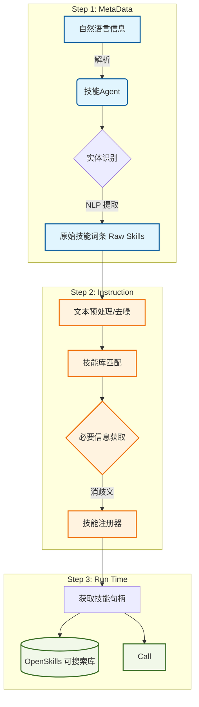

## 该文件包含调用技能时的信息流走向,协助后续开发者理解openskills框架

```mermaid
graph TD
    %% 样式定义
    classDef source fill:#e1f5fe,stroke:#01579b,stroke-width:2px;
    classDef core fill:#fff3e0,stroke:#ef6c00,stroke-width:2px;
    classDef storage fill:#f1f8e9,stroke:#33691e,stroke-width:2px;

    %% 步骤一：读取与提取
    subgraph Phase1 [Step 1: MetaData]
        A[自然语言信息] -->|解析| B(技能Agent)
        B --> C{实体识别}
        C -->|NLP 提取| D[原始技能词条 Raw Skills]
    end

    %% 步骤二：清洗与对齐
    subgraph Phase2 [Step 2: Instruction]
        D --> E[文本预处理/去噪]
        E --> F[技能库匹配]
        F --> G{必要信息获取}
        G -->|消歧义| H[技能注册器]
    end

    %% 步骤三：输出与应用
    subgraph Phase3 [Step 3: Run Time]
        H --> I[获取技能句柄]
        I --> J[(OpenSkills 可搜索库)]
        I --> K[Call]
    end

    %% 应用样式
    class A,B,D source;
    class E,F,G,H core;
    class J,K storage;
```