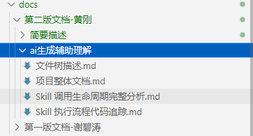

# 推荐观看流程

1.先看谢碧套的文档配好环境（注意：要使用npx导入openskills）

导入命令是这个

npx openskills install anthropics/skills
npx openskills sync

2.再看本文档的项目介绍（简要描述文件夹）

3.对话智能体流程介绍，这个时候按照给的案例自己跑一下，感受一下

4.用户自定义技能介绍 ai辅助理解文件夹下的文件树做辅助

5.公司技能介绍 ai辅助理解文件夹下的技能流程做辅助

6.ai辅助理解文件夹下的所有文件过一遍