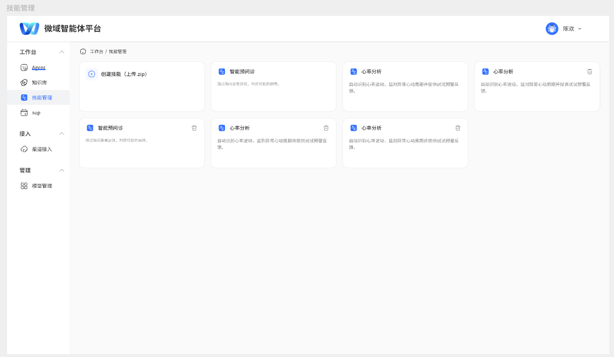
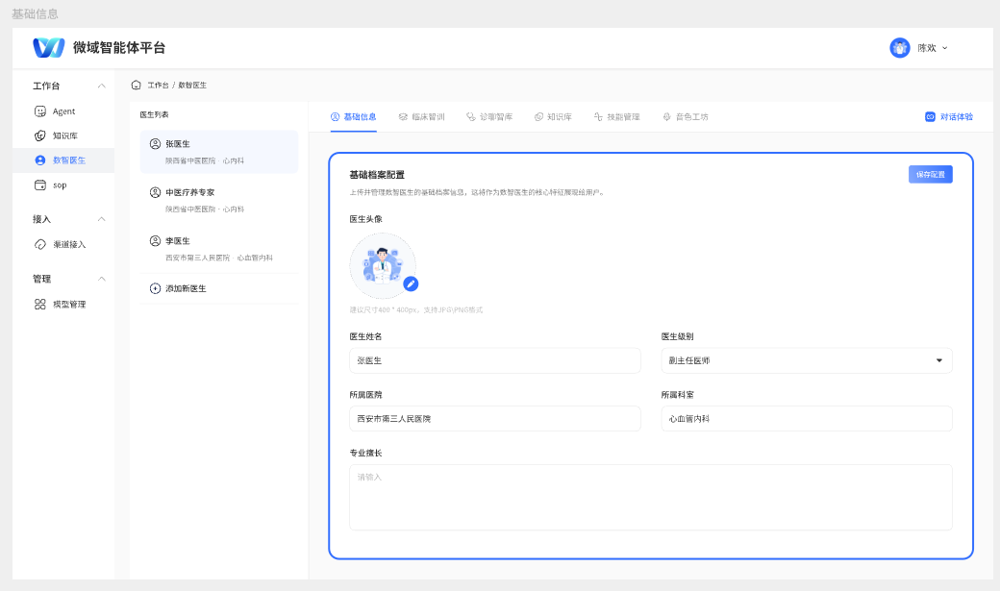
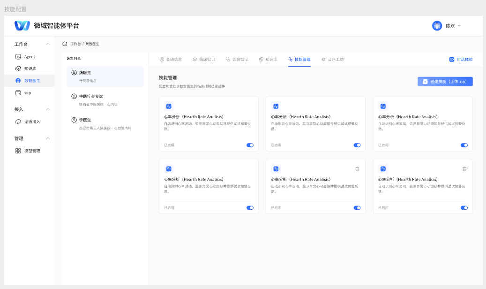
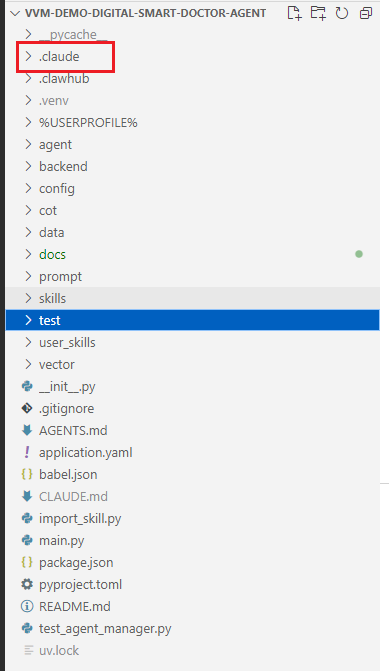
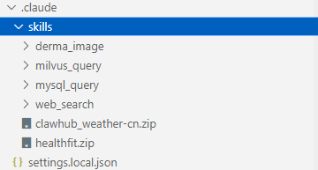
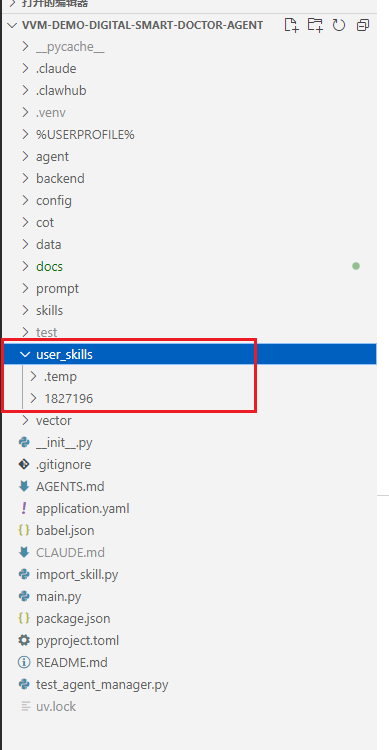
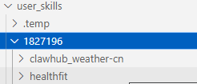

# 整体项目功能介绍

这是一个skill管理的项目

项目目的是开发一个多租户的技能管理框架，支持咱们公司内部给用户开发的技能和用户自己上传技能的使用。

这是用户的技能列表，这里面会显示咱们公司已经开发好的技能，和用户自己上传的技能，然后用户可以删除自己上传的技能。

用户可以定义自己的医生智能体，每个医生智能体有不同的技能，但这些技能都是上面用户技能列表里面的

每个医生可以启用/弃用用户的技能列表，因为技能一多可能大模型会选错，让他们专一化是有价值的

# 你的主要目标有两个

## 1.为vvm开发工具

我现在开发了四个功能：（后面会有一个文件专门去给每个功能截图介绍，这里先简要描述一下）

#### 1.用户信息查询-》通过mysql

这个是通过数据库查询用户的基本信息 就诊记录 检查结果去回答用户的相关信息

#### 2.知识向量库查询-》通过向量库

询非患者特异性的公共医学知识（涵盖疾病标准名称及常见俗称、症状、药物、胃肠文献等）。支持两阶段检索与LLM重排，确保语义相关性。当用户询问**“XX病是什么”、疾病定义、发病原理及通用治疗方案时必须触发**。

#### 3.图片检测-》yolo

皮肤病图片检测技能，支持使用 YOLO 模型（YOLOv10/v11）进行皮肤病图片检测。这个可以检测7中皮肤病，因为段总买的数据集只有7种皮肤病，模型不是我训练的 

#### 4.网络搜索-》调用taivuls api实现

通过 Tavily API 进行互联网搜索查询最新信息和通用知识。当用户询问实时信息、医学常识、药物信息或需要互联网上的最新数据时使用。

## 2.管理用户上传的自定义工具

这里只有两个压缩包供你测试功能是否开发完整

一个是天气报告，输入地址可以返回当天气温

一个是用户健康管理系统，这个skill比较大，有些功能受限于现在的代码结构不太能调起来

# 然后这不是分两种情况麻，我就给这两个大功能分在不同地方存起来了

## 1.自己开发的

放在这里.claude\skills

每个技能一个文件夹，然后还有测试用户上传的两个技能的压缩包

## 2.用户上传的

放在这里user_skills，每个用户一个文件夹，文件夹下每个技能一个文件夹

