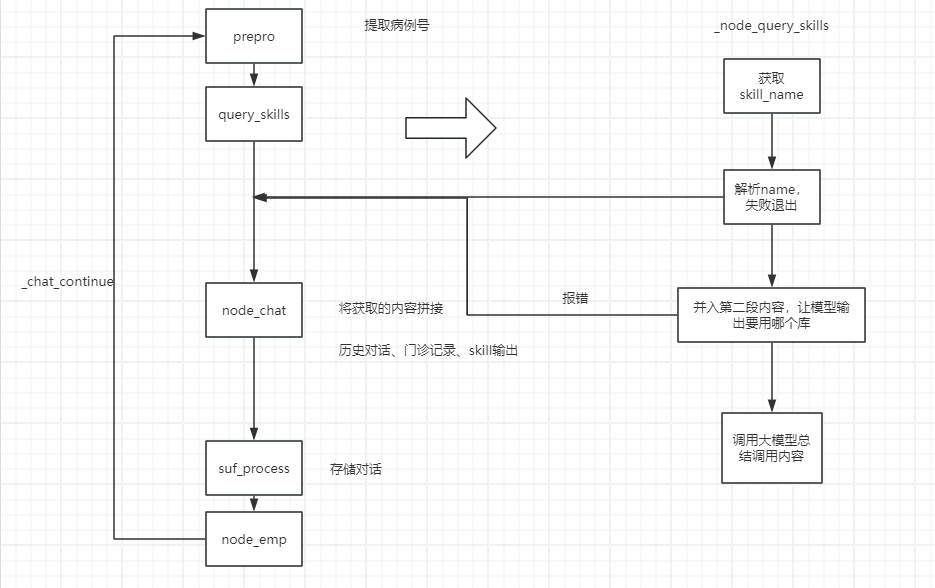
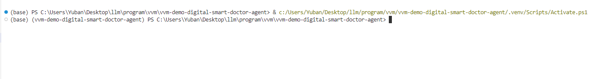
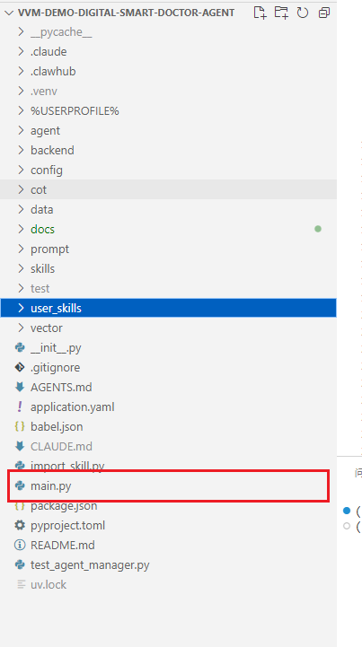
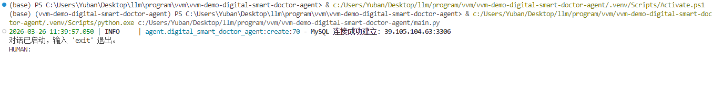
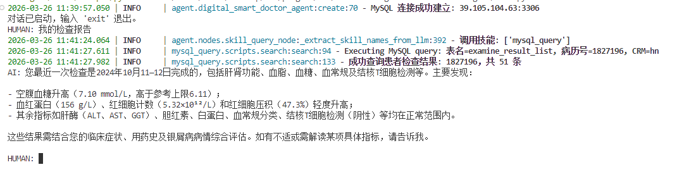
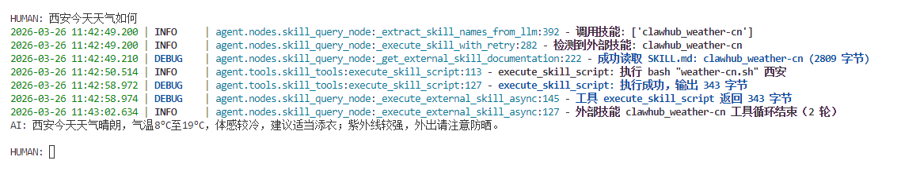

# 对话智能体流程介绍

这是我刚入职的之后画的，现在流程大体上还是一样的，不过有些细节可能改变了，你得注意一下。

然后我这边会给出一个具体的案例供你测试。

# 1运行

先去看看谢碧涛的uv导入，将你的uv环境配好，然后换到你创建好的uv环境中

运行根目录下的main文件

# 2流程

跟chatbot流程差不多，就是对话->根据问答调用技能->回答

## 2.1普通对话

调用哪些技能，调用技能结果我都log在控制命令行了

## 2.2 含图片对话

这个是用命令的方式去调用，格式是`!image + 图片路径`

现在文件夹下放着一个皮肤病测试图片和一个普通测试图片供你使用。

路径是这个`.claude\skills\derma_image\references\runs\detect`

可以加上询问，也可以什么都不加

### 加上询问

`!image c:\Users\Yuban\Desktop\llm\program\vvm\vvm-demo-digital-smart-doctor-agent\.claude\skills\derma_image\references\runs\detect\current_result.jpg 皮肤状况怎么样`

你的路径该改一下

### 什么都不加

会询问用户意图

`!image c:\Users\Yuban\Desktop\llm\program\vvm\vvm-demo-digital-smart-doctor-agent\.claude\skills\derma_image\references\runs\detect\current_result.jpg`

你的路径该改一下

