# 用户自定义技能介绍

## 1.如何实现多租户技能管理

将每个用户 的技能 智能体 智能体-技能表存在数据库，需要相应信息的时候查询

## 1.1数据库存在哪里？

根目录下有一个配置文档`application.yaml`

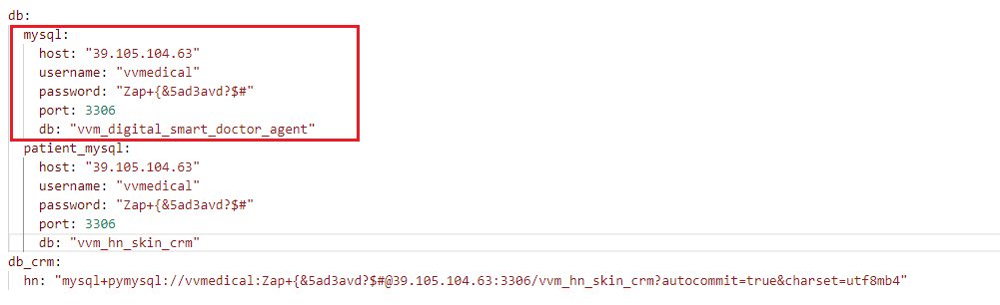

存在红框这个文件夹下

## 1.2有哪些表？

有三个表

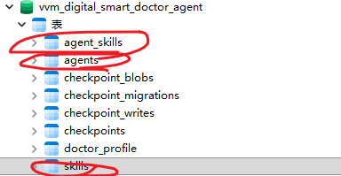

skill-->用户-技能

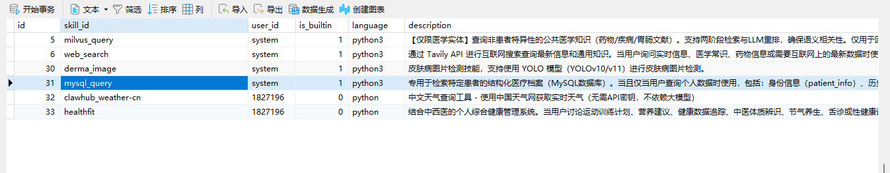

agent-->用户-智能体

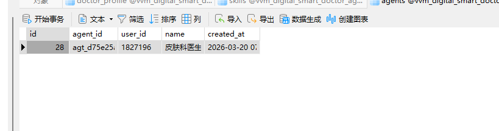

agent-skill-->智能体-技能

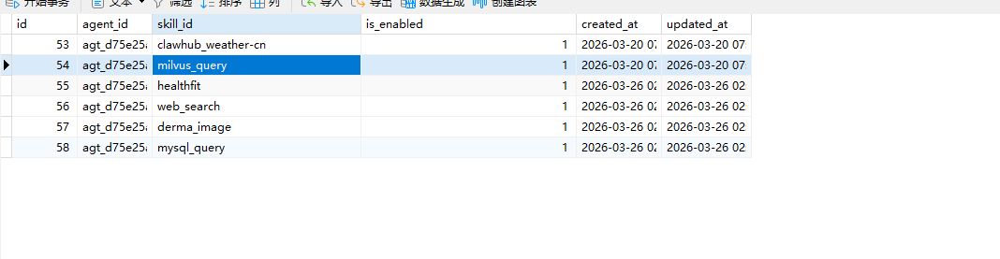

相应字段的描述代码里有，我后边再说，你先往下看

## 1.3用户技能存放在哪里？

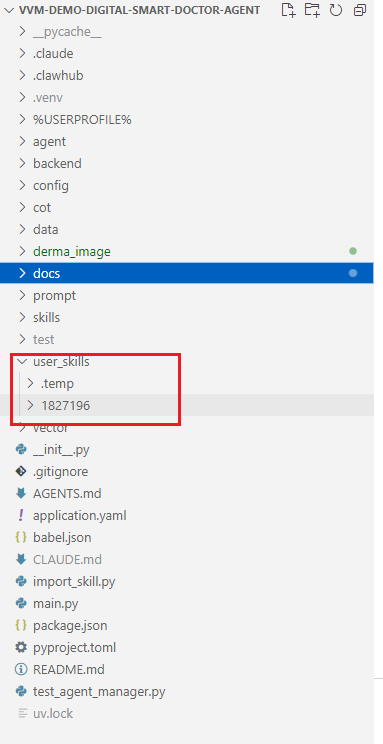

存在根目录下的user文件夹，每个用户一个文件夹，每个技能在该用户下新建一个文件夹

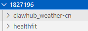

## 1.4这个数据库表配套的后端在哪？ 测试文件在哪？

我已经写好了三个表的crud（增删查改），以及配套的流程并调试好了，后面上线你做一个代码的迁移就可以

这个所有代码都在/backend文件夹下，但是测试文件在根目录下，第二点会跟你说的

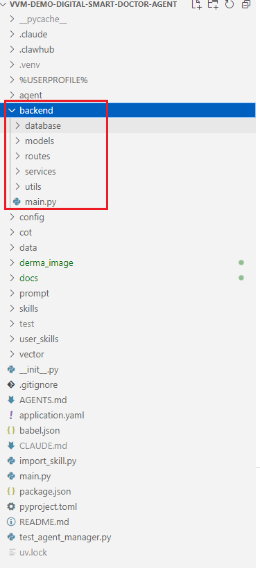

# 2.现在接口还没有开发完全，如何上传技能

我已经写好了调用后端接口的一个完整案例

是根目录下的这个文件`test_agent_manager.py`

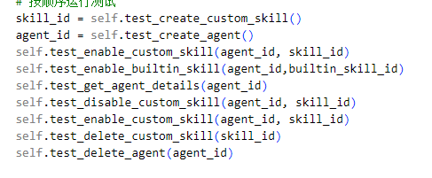

## 2.1 测试流程

这个就是上面代码的流程，应该是把要用的功能全部测试了一遍

1.用户上传技能

2.用户创建智能体

3.智能体启用用户自定义技能

4.智能体启用公司技能

5.查找某个智能体启用哪些技能

6.智能体弃用某个功能

7.删除技能

8.删除智能体

## 2.2上传技能的整个流程

运行self.test_create_custom_skill()

插入到skills表

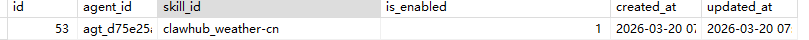

在本地文件夹上传这个技能

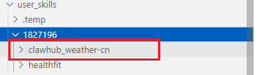

调用时会在对应文件夹搜索脚本名称，搜索到了才会执行脚本
