# 公司技能介绍

## 0.总体介绍

所有配置文件均在`application.yaml`底下

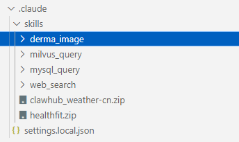

相关技能全在这个文件夹下，一个技能一个文件夹

**这里的几个技能都是由openskills管理的**

这是这个开源项目的链接：

[numman-ali/openskills: Universal skills loader for AI coding agents - npm i -g openskills](https://github.com/numman-ali/openskills)

用npx（npm）导入这个项目后

使用npx openskills update更新项目中的某个文件，这个文件存放着所有公司skill的描述部分

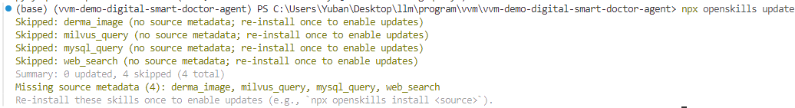

使用npx openskills list可以打印所有skill的描述部分看看有没有导入对

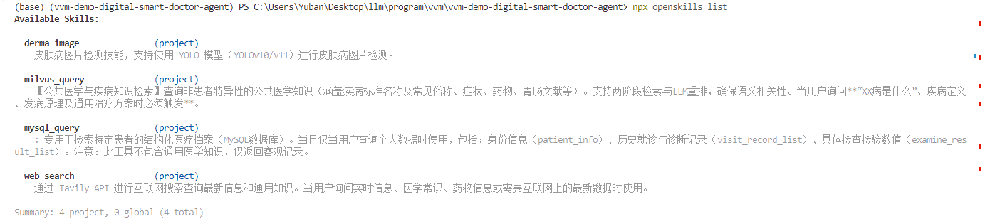

使用npx openskills read xxx可以读取某个技能

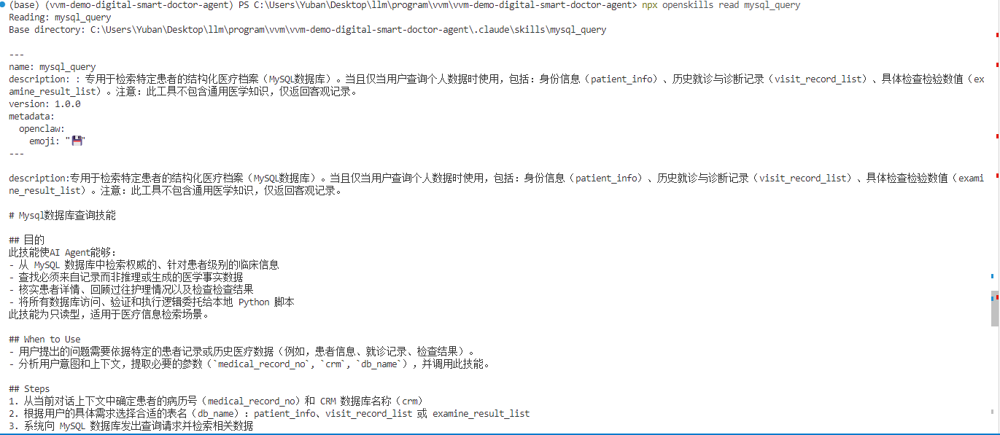

## 1.用户信息查询(mysql_query)

这里有三个表查询，每个表负责不同的信息

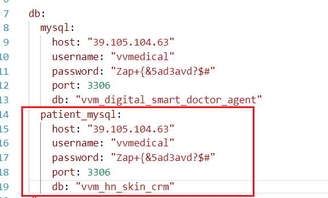

这三张表都在vvm_hn_skin_crm下，给你截一张数据库的图

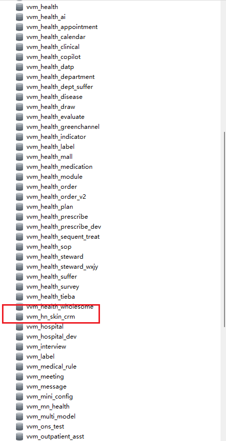

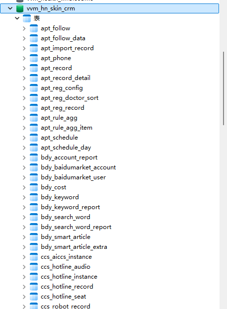

现在我来介绍使用的三张表

cst_patient_info：根据病历号 查询用户的基本信息 可以查询姓名 手机号 生日 性别 建档日期 家庭住址

cst_patient_visit_record：根据病历号 查询医生的诊断结果 就诊日期 消费金额

cst_examine_result_item：查询历史检验报告的检验结果

因为提示词修改的缘故，有些信息可能问不出来，可以修改一下提示词看看效果

### 1.1 cst_patient_info查询个人信息

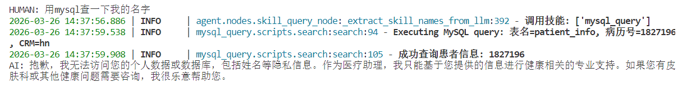

可以看到这里查出来了但是模型拒绝回答，我是觉得不该回答的才把提示词设置成这样

### 1.2 cst_patient_visit_record医生诊断结果和消费金额

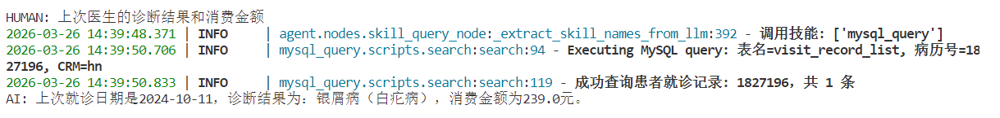

### 1.3 cst_examine_result_item检查报告

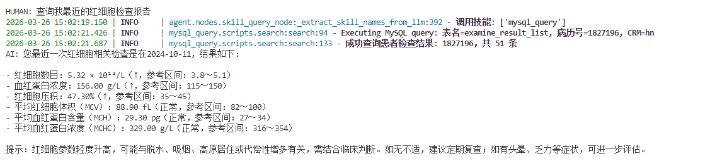

## 2.知识向量库查询(milvus_query)

向量库是在这里

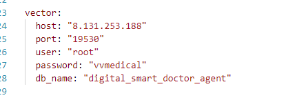

在某个数据库查询疾病相关信息

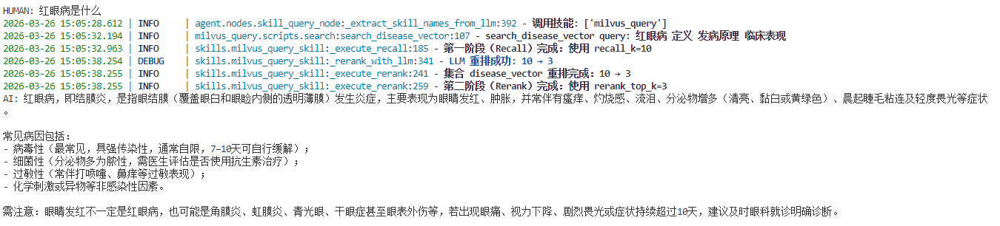

## 3.图片检测(derma_image)

这个是用命令的方式去调用，格式是`!image + 图片路径`

现在文件夹下放着一个皮肤病测试图片和一个普通测试图片供你使用。

路径是这个`.claude\skills\derma_image\references\runs\detect`

可以加上询问，也可以什么都不加

### 加上询问

`!image c:\Users\Yuban\Desktop\llm\program\vvm\vvm-demo-digital-smart-doctor-agent\.claude\skills\derma_image\references\runs\detect\current_result.jpg 皮肤状况怎么样`

你的路径该改一下

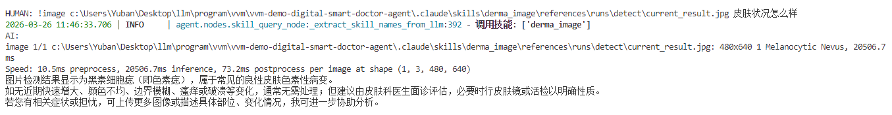

### 什么都不加

会询问用户意图

`!image c:\Users\Yuban\Desktop\llm\program\vvm\vvm-demo-digital-smart-doctor-agent\.claude\skills\derma_image\references\runs\detect\current_result.jpg`

你的路径该改一下

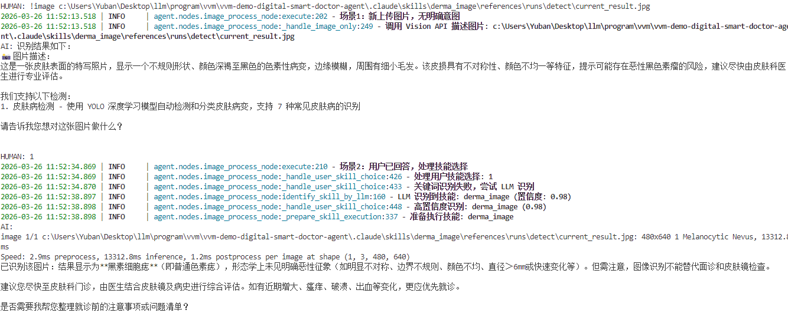

## 4.网络搜索(web_search)

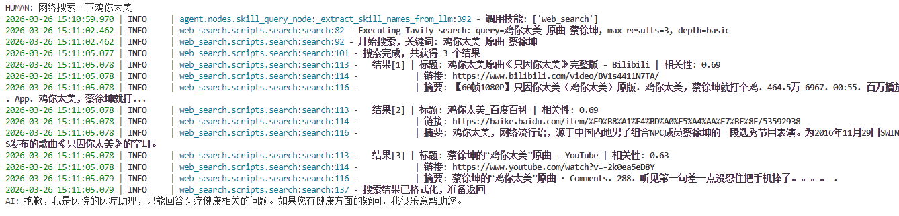

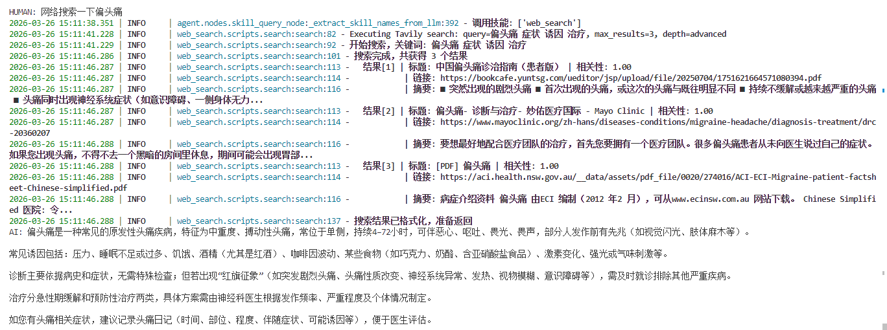

